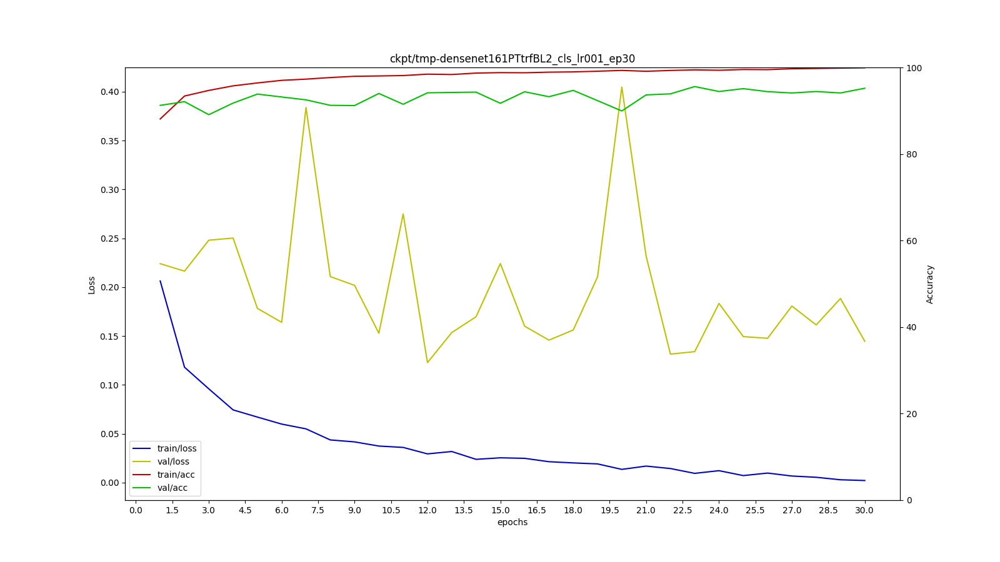
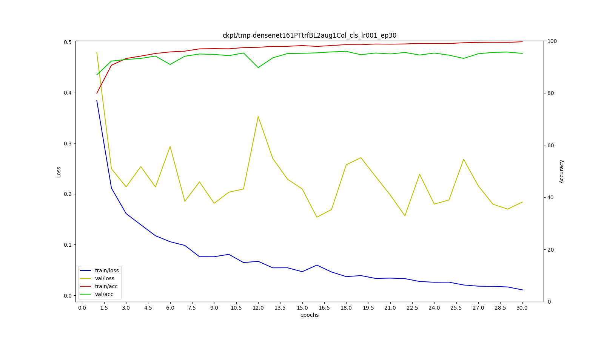
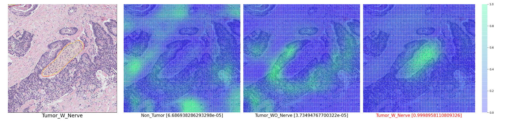

# paip_aug

- direct augmentation
  - aug_data
    - allocation.py : Create nerve/tumor allocation dictionary
    - traslation.py : Translate a nerve to tumor areas

- training
  - train
    - train.py            : training module
    - confusion_matrix.py : evaluate trained models

- Sample results

  - PNI classification results by DenseNet161 with default augmentation
  
  
    |                 | precision | recall | f1-score |
    | --------------- | --------- |-------- |-------- |
    | Non-Tumor       | 0.97  |0.94  |0.96  |
    | Tumor w/ Nerve  | 0.96  |0.98  |0.97  |
    | Tumor w/o Nerve | 0.86  |0.90  |0.88  |
    
    
    | TRAIN lr: 0.00004831 ave_score: 0.99369 loss: 0.00943 acc: 99.44335 |
    |-|
    | VAL lr: 0.00004831 ave_score: 0.97057 loss: 0.13403 acc: 95.58293 |
  
  - PNI classification results by DenseNet161 with default plus our augmentation strategy
  
  
    |                 | precision | recall | f1-score |
    | --------------- | --------- |-------- |-------- |
    | Non-Tumor       | 0.98  |0.95  |0.97  |
    | Tumor w/ Nerve  | 0.95  |0.98  |0.97  |
    | Tumor w/o Nerve | 0.90  |0.89  |0.89  |
    
    | TRAIN lr: 0.00001827 ave_score: 0.99424 loss: 0.01654 acc: 99.35736 |
    |-|
    | VAL lr: 0.00001827 ave_score: 0.96676 loss: 0.17011 acc: 95.64303 |
    
    
- Attention map

